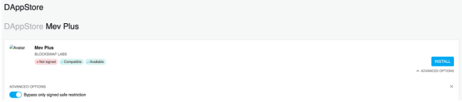

# DAppNode Package for MEV Plus

This package allows Dappnode solo stakers to natively delegate their stake and earn restaking ETH rewards.

Native delegation makes the Ethereum stake available on the Ethereum execution layer smart contract and therefore the native delegation process will require GAS to register validators from the node and do the stake delegation which is then tracked by the Ethereum execution layer.

For more information about the MEV Plus module take a look at the docs:
https://docs.restaking.cloud/middleware/mevPlusModule

Please see the above doc if `EXTRA_OPTS` in the MEV Plus DAppNode Package config are required to control which validators are natively delegated and which are not. By default, all of the validators on the node will be natively delegated.

## Installation and setup wizzard



Installation may require by passing signing restrictions as per above screenshot.

Once the installation starts the setup wizard will guide in adding the Ethereum wallet that will pay for GAS:


If required to adjust the MEV Plus config to add any additional flags such as the inclusion list, please make those adjustments at this stage.

## Updating the beacon node
We will use the lighthouse as an example for how to configure your beacon node.

Lets enter Packages -> Lighthouse -> Config -> Show Advanced Editor

`_DAPPNODE_GLOBAL_MEVBOOST_MAINNET` will need to be adjusted to `false` on the `Beacon chain` node only.

In the EXTRA_OPTS section of `Lighthouse Beacon Chain`, we need to inject the following:
```
--builder http://mev-plus.public.dappnode:18551
```

We need to proceed to restart MEV Plus (and potentially the consensus node) and then watch native delegation take place. The MEV Plus logs will look like this when interacting with a node that is not yet synced:


And the MEV Plus logs will look like this when the node is synced and operational:


And finally if native delegation is taking place the following logs can be observed:

